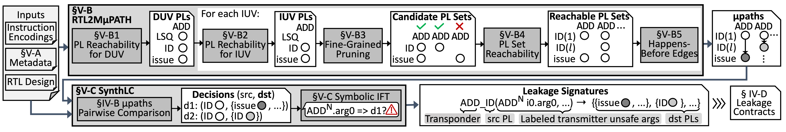

# RTL2MμPATH – Minimal examples

## Minimal example on division operation 
This part we will walk through an example to demonstrate the properties and code bases that correspond to each step discussed in §V-B1 to §V-B5 (i.e., the flow at the top in Fig. 5 or the figure as below).

The example considers a `DIV` division operation as IUV and an execution assumption that `DIV` is issued right after hard reset followed by no valid instructions (we call NIA assumption in the following). 

The said assumption is not necessary for execution of RTL2MμPATH; rather it is to reduce the time to run RTL2MμPATH while demostrating the full flow of RTL2MμPATH and SynthLC within a reasonable amount of time (less than a total of three hours), since under no execution assumption (as used in our case study) we will have tens of paths and tens of thousand properties generaertd and evaluated for each IUV. 

We now run RTL2MμPATH per IUV part (i.e., the `For each IUV` box in Fig. 5) on `DIV`, which can take from 20-40 min in total:
`$ cd fv/synthlc; ./run_an_instn_demo.sh DIV.sv` 

The following explains the key steps in the script.

1. Step 1 in RTL2MμPATH is to derive IUV PLs as discussed in §V-B2 and correspond to code in the direcotry `fv/syntlc/xCoverAPerflocDiv`. This directory and ones mentioned in the following text will be instantiated for the instruction under verification (`DIV` in this case) and put under the evaluation folder to specialize the step for the IUV.
As an example, one should be able to see a total of 40 properties in `fv/synthlc/i_DIV_out/xCoverAPerflocDiv/cover_individual.sv`, each of which asks if there exists a trace where DIV execution reaches the PL that appears in the property. 

2. Step 2 in RTL2MμPATH is to do fine-grained pruning as discussed in §V-B3 and correspond to the direcotry `fv/syntlc/xPairwiseDepDiv`. 
Due to the aforementioned assumptions, there will not be no properties instsantiated. But in the next section where we run a larger experiment we should be able to see  One will see the dominates (exclusive) relationships under `fv/synthlc/i_DIV_out/xPairwiseDepDiv/out/{exclusive_0,1..}.sv`. 
This step uses the `pl_0_dom_pl_1` and `pl_0_excl_pl_1` property templates as shown in §V-B3 of the paper.  

3. Step 3 in RTL2MμPATH is to do determine PL set reachability as discussed in §V-B4 and correspond to the direcotry `fv/syntlc/xPerfLocSubsetDiv`. 
One will see each candidate PL set being instantiated as single property in `fv/synthlc/i_DIV_out/xPerfLocSubsetDiv/out/coverset_<>.sv`. As an example, in `fv/synthlc/i_DIV_out/xPerfLocSubsetDiv/out/coverset_0.sv` one should see a property `C_0_N` generated that evaluates if `DIV` execution reach exactly the PLs in the parenthesis:  
`assume property (@(posedge clk_i) !serdiv_unit_divide_s2); 
C_0_N: cover property (@(posedge clk_i) serdiv_unit_divide_s1_hpn & id_stage_s1_hpn & issue_s8_hpn & scb_0_s13_hpn & scb_0_s8_hpn & 1'b1 & !(serdiv_unit_divide_s1 | id_stage_s1 | issue_s8 | scb_0_s13 | scb_0_s8 | 1'b0));`
This property is instantiated using the `cand_pl_set` property template as shown in §V-B4 of the paper.  

4. Step 4-6 in RTL2MμPATH is to do determine HB edges for each reachable PL set as discussed in §V-B5 and correspond to the direcotry `fv/syntlc/{xHBPerfG_dfg_v3_div, xPerfLocCycleCount, xHBPerfG_leaving}`. 
Specifically, the directory `xHBPerfG_dfg_v3_div` is to generate properties to determine the happens-before order between entering two PLs. 
The directory `xPerfLocCycleCount` is to generate properties to determine revisit behavior. 
The directory `xHBPerfG_leaving` is to generate properties to determine the happens-before regarding leaving PLs.

5. Step 7 in RTL2MμPATH is to to enumerate all number of cycles in which an instruction may revisit a particular PL as discussed in §V-B6 and correspond to the directory `xEnumCycleCnt`. 
One should be able to see in `fv/synthlc/i_DIV_out/xEnumCycleCnt/res.txt` that `DIV` is able to stay in `serdiv_unit_divide_s1` active state of serial division circuitry for 1 to 65 cycles.

6. The remaining steps assemble the paths and summarize all paths in the folder `xSummarize/nonisograph`. 
As an example, the folder `fv/synthlc/i_DIV_out/xSummarize/nonisograph` will be generated once the scripts finishes. 
The folder will contain all `DIV` paths found under the  for `DIV`.   
One should be able to see all 66 paths realizable for `DIV` under NIA assumption summarized in **two** png files.   
In [`com_0_0_0.png`](./fig/div_com_0_0_0.png) the `DIV` visits `id_stage_s1`, `issue_s8`, `scb_0_s8`, and `scb_0_s13`, which respectively correspond to the labels `ID`, `Issue`, `scbIss`, and `scbCmt` in Fig. 1 and Fig. 2 in the paper.  Also note that in this path `serdiv_unit_divide_s1` is stayed for exactly one cycle (as no `serdiv_unit_divide_s1___final` is instantiated) before committing at `scb_0_s13`.   
In [`com_1_0.png`](./fig/div_com_1_0.png) there are a total of 65 paths summarized with the label edges (0-66). Specifically, `DIV` visits the same set of PLs plus two additional labels `serdiv_unit_divide_s1___final` and `serdiv_unit_divide_s2` which correspond to the active and finish state of serial division circuitry. In this paths, `DIV` does revisit the `serdiv_unit_divide_s1`!
Along with the information in previous step, we derive that `DIV`'s stay in serial division circuitry (includign active and finished states) can range from 1 to 66 cycles as reported in result section (§VII-A1) in the paper. 

In [next step](./04-synthlc.md) we will show the decisions and SynthLC given the paths we derived.