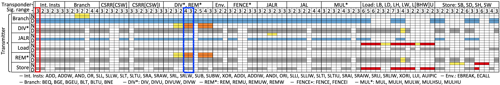

# SynthLC – Minimal example on division operation (cont.)

Now, we will continue the `DIV` example that derives multiple paths in the previous step and pass them as input to the SynthLC to figure what instruction's operand value can cause the path variability. The following will show properties and code bases that correspond to each step discussed in §IV-B, §V-C and the leakage signature (i.e., the flow at the bottom in Fig. 5 or the figure as below).


In this step, we are going to first collect decisions from the existing paths. Assume now `DIV` can be preceded and followed by arbitrary instructions, SynthLC will determine the leakage signature for `DIV` with respect to the decision source PLs (§IV-B).

We configure SynthLC to consider only a subset of instructions in the RISC-V ISA as candidate transmitters: `ADD, DIV, BEQ, LW, SW` for this demo. Once again, this is only to shorten runtime and demostrate the SynthLC; our evaluation result in the paper consider all 72 instructions as candidate transmitters. 

First let's setup scripts and prepare the IFT-instrumented design for SynthLC:   
`$ cd fv; ./setup_scripts_ift.sh`

Now we run SynthLC given the paths from previous step:   
`$ cd fv/synthlc;  ./run_an_instn_demo_ift.sh DIV.sv | tee div_run_synthlc.log`

This script may take a total of 5 to 7 hours and does the following.

1. In `i_DIV_out/xSummarize`, SynthLC first derives the set of decisions in `follower_set_v2.txt`. Opening the file, one should be able to see following: 

    ```
    serdiv_unit_divide_s1:2 
    scb_0_s13
    serdiv_unit_divide_s1___final
    serdiv_unit_divide_s2:1
    scb_0_s13
    ...
    ```
    This shows that `serdiv_unit_divide_s1` is a decision source PL that can be followed by two different PL sets: {scb_0_s13} and {serdiv_unit_divide_s1___final}. That is, `DIV` either commits or continue to stay in `serdiv_unit_divide_s1`. 


2. In `xDecisionsIntrinsic`, SynthLC first generates properties using templates (`decision_taint`) shown in §V-C. 
Specifically, this steps determines if decisions of the current IUV (transponder) depends on any of its own operand. That is, this step checks if `DIV` is an intrinsic transmitter (§IV-B). 

3. In `xDecisionsDyn`, SynthLC consider, for each operand and instruction pair, as a candidate transmitter operand and generate IFT property to check if a decision for the IUV can be tainted by the candidate transmitter's operand. That is, it tries to evaluate if a decision of IUV can depend on a candidate transmitter's operand rs1 or rs2. If so, we find a dynamic transmitter and its operand.


When `run_an_instn_demo_ift.sh` finishes, we will see the following (or the log file at `xDecisionsDyn/leakage_signature.log`):
```
                       DIV     ADD     LW      SW      BEQ     
                       N   D   N   D   N   D   N   D   N   D  
         operand rs1/2 1 2 1 2 1 2 1 2 1 2 1 2 1 2 1 2 1 2 1 2
serdiv_unit_divide_s1  1 1 1 1 0 0 0 0 0 0 1 0 0 0 1 0 0 0 1 1 
iso_4                  1 1 1 1 0 0 0 0 0 0 1 0 0 0 1 0 0 0 1 1 
```

Each row starts with a decision source PL and the leakage signature (1 indicate dependence on the operand of the labeled transmitter indicated in the first two lines). This is a transpose version of a single column of the Fig. 6 in §VII of the paper (or figure shown below). 


Specifically, the top/bottom rows indicate `DIV` has decision source PL `serdiv_unit_divide_s1`/`iso_4` (this correspond to the `scbIss` scoreboard issue state in the paper) and rougly correspond to the columns highlighted by the blue box in the figure. They difffer mainly in 1) the leakage signature range since the path synthesis for `DIV` in previous step is conduced under non-interference assumption, and 2) the missing transmitters `JALR` and `REM` since we are only consider the aforementioend five instructions for our demostration. 

Importantly, this reproduces the results in §VII that 1) `DIV` is indeed a dynamic and intrinsic transmitter, and 2) `DIV` as a transponder can be stall due to dynamic rs1 of `LD` and `ST` and rs1/rs2 of dynamic `DIV`.


Finally we demonstrate the static transmitter check: 
`$ cd fv/synthlc; ./run_static_ift.sh`
This steps generates property checks if there exists any instruction that can be a static transmitter to any other instruction. At the end of the execution, one will see
```
...
Any static channel exist?
[]
```
That is, the result returns that no static transmitter is found for CVA6 core evaluation, just as reported in paper. 
