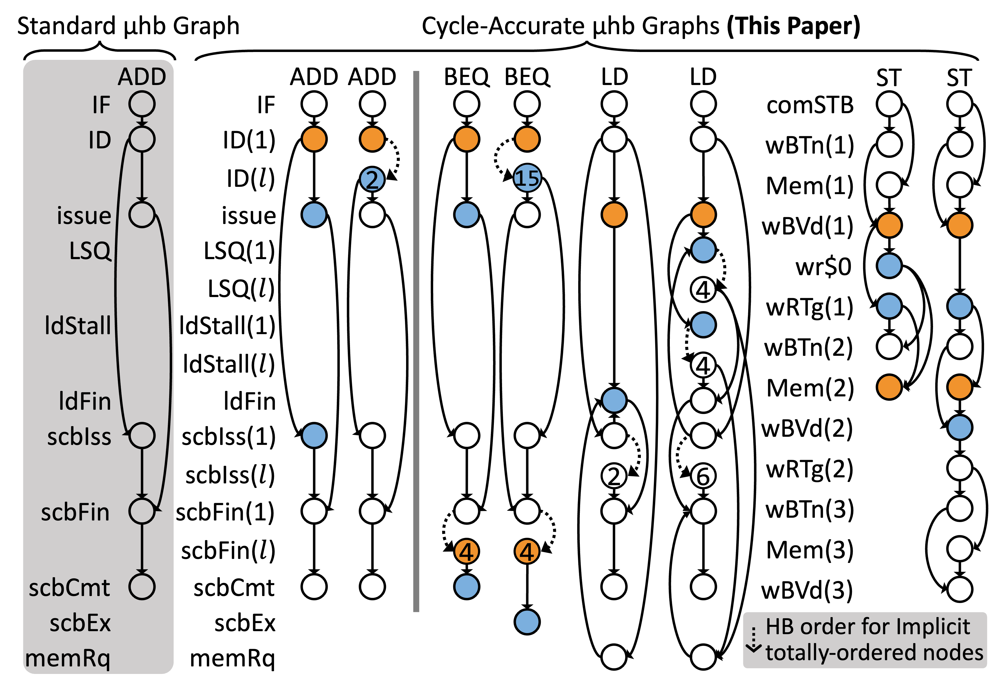

# RTL2MμPATH – Example II with mini-ISA

In previous few sections, we have reproduced multiple results related to `DIV` in the paper, including:  
a. RTL2MμPATH automatically uncovering sixty-six cycle accurate paths,
b. SynthLC labeling `DIV` as intrinsic and dynamic transmitter, and
c. SynthLC finds `DIV` as transponder to `BEQ` and `LW/SW` dynamic transmitters as a function of their `rs1/rs2` and `rs1` respectively.  

However, one catch is that `DIV` paths synthesis is carried under a limited assumption, the non-interference assumption as discussed in [in previous sections](./03-rtl2mupath.md). 

In order to reproduce interesting paths that appear in Fig. 2 of the paper (or the figure below), we now consider a restricted RISC-V ISA that implements the following five instructions: `ADD`, `BEQ`, `LW`, `SW`, and `DIV`. For a given IUV, we deploy RTL2MμPATH with the assumption that the IUV can preceded or followed by arbitray instructions.
We will reproduce the paths of `ADD, BEQ, LD` as shown in figure below. 
<figure>
  
  <figcaption>Fig. 2 of the original paper</figcaption>
</figure>

* `ADD`, estimated time: 2 hours.   
  `$ cd fv/synthlc; ./run_an_instn_demo_subset.sh ADD.sv | tee add_run_subset.log`
  The set of paths uncovered will be in `fv/synthlc/i_ADD_out/xSummarize/nonisograph`.  
  A single PNG file `i_ADD_out/xSummarize/nonisograph/com_4_0.png` can be found to be summarizing the two paths for `ADD` in Fig. 2. One will get a picture look like [this file](./fig/add_com_4_0.png), where the `id_stage_s1` and `id_stage_s1___final` correspond to the `ID(1)` and `ID(l)` in the Fig. 2. When the green edge connecting the two is equal to zero, the path correpsond to the left path for `ADD` in the Fig. 2 of the paper.    
  `issue_s32`/`scb_0_s8`/`scb_0_s12`/`scb_0_s13` node correspond to the `issue`/`scbIss`/`scbFin`/`scbCmt` node in the Fig. 2. 

* `BEQ`, estimated time: 2.5 hours.  
  `$ cd fv/synthlc; ./run_an_instn_demo_subset.sh BEQ.sv | tee beq_run_subset.log`
  The set of paths uncovered will be in `fv/synthlc/i_BEQ_out/xSummarize/nonisograph`.  
  One can find that `com_5_0.png` and `com_2_0.png` in this folder correspond to the left and right path for `BEQ` in Fig. 2 respectively. One should be able to see pictures look like [left path file](./fig/beq_com_5_0.png) and [right path file](./fig/beq_com_2_0.png). 
  In the `com_5_0.png`, the `scb_0_s13` is reached, whereas in `com_2_0.png` (for right path) the `scb_0_s14`, corresponding to `scbEx` in Fig.2 is reached. 
 
* `LW`, estimated time: 35 hours. 
  `$ cd fv/synthlc; ./run_an_instn_demo_subset.sh LW.sv | tee lw_run_subset.log`
  The set of paths uncovered will be in `fv/synthlc/i_LW_out/xSummarize/nonisograph`.    
  One can find that `com_4_0_0.png` and `com_16_0_0.png` in this folder correspond to the left and right path for `LW` in Fig. 2 respectively. One should be able to see pictures look like [left path file](./fig/lw_com_4_0_0.png) and [right path file](./fig/lw_com_16_0_0.png). 
  In the `com_16_0_0.png`, the `load_unit_op_s3`/`lsq_enq_0_s1` correspond to the `ldStall`/`LSQ` in the Fig. 2, which are not reached in left path of `com_4_0_0.png`.
  In `i_LW_isa_subset_out/xEnumCycleCnt/res.txt`, one can also see a line showing `lsq_enq_1_s1:1,2,3,4,5`, indicating that `LW` can stay in LSQ for exactly 1, 2, 3, 4, or 5 cycles, macthing the tag `4` for the `LSQ(l)` node in the Fig. 2.
  

