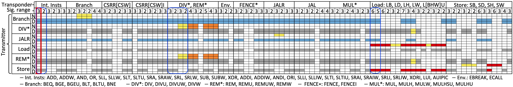
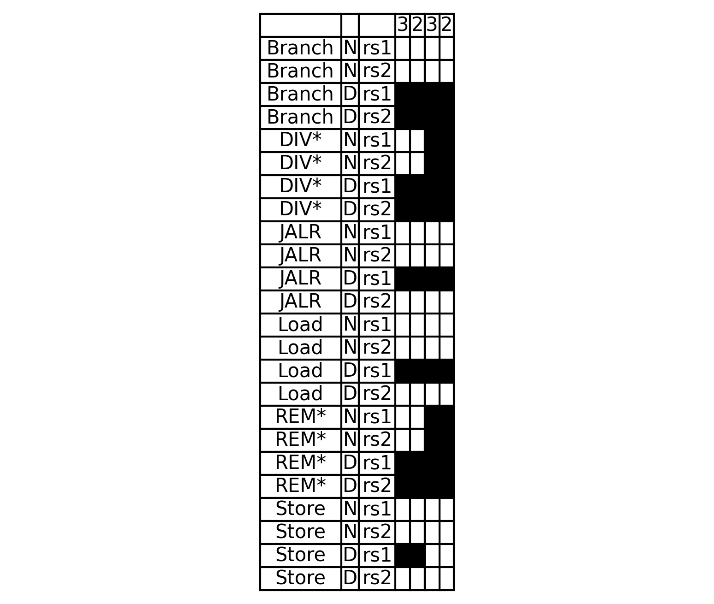
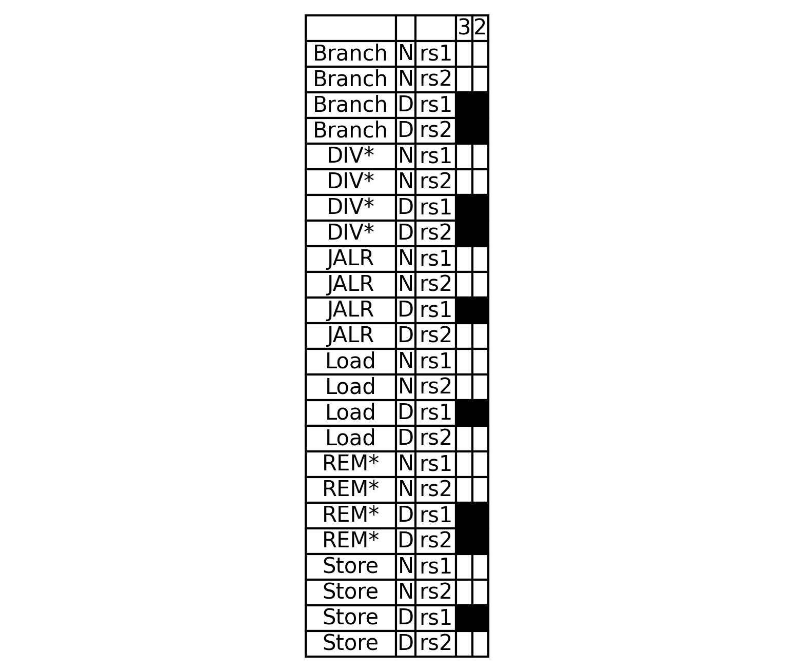
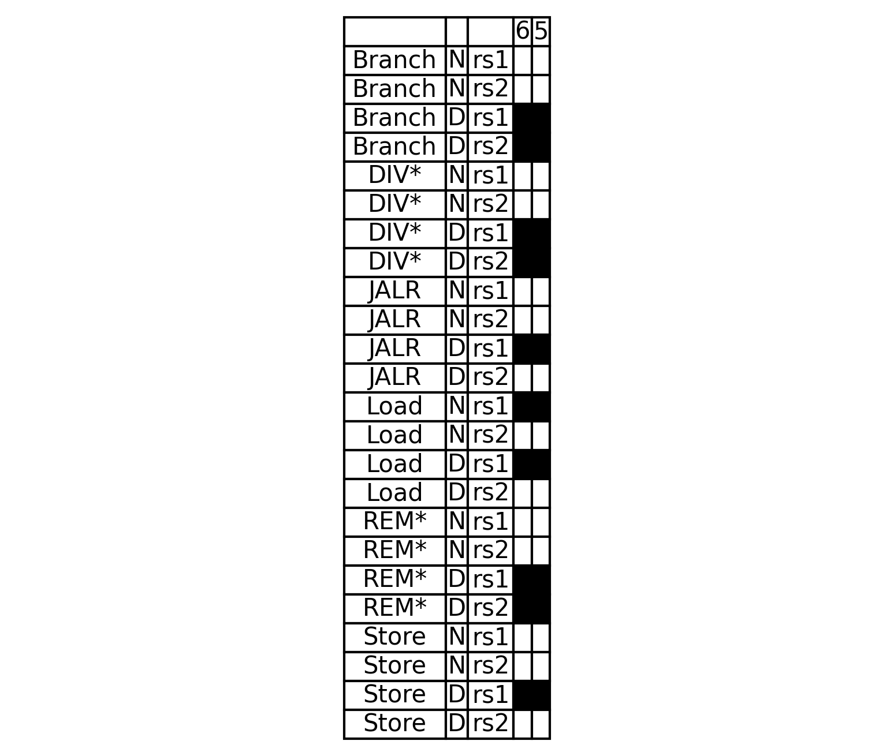

# SynthLC – Complete Result

In this artifact, we have included in our dataset the full set of μPATHs synthesized by RTL2MμPATH for CVA6 (for all 72 instructions in the RV64IM ISA) in our submission-time case study (§VI), since RTL2MμPATH can take a significant amount of time to explore all 72 instructions. 

Given these μPATHs, now we will deploy SynthLC on CVA6 *incrementally* synthesize a comprehensive set of leakage signatures (Fig. 7 columns) one at a time using SVA property generation and evaluation (§V-C1). 

The flow can take over a week or more to finish depending on one’s machine to reproduce Fig. 7 of the paper (or the figure shown below).

One can stop the process early to observe a partial version of Fig. 7. This experiment primarily aims to showcase the details of SynthLC, which is the culminating contribution in this paper.

Below we provide instruction to reproduce Fig. 7 one transponder group (megacolumn) at a time. 
Depending on the number of decisions the leakage signatures control, the script invoked below incrementally produce results at a rate of about one leakage signatures every 10 x 3/N $\sim$ 40x 3/N hours when machine is configured to run `N` jobs in parallel (ref: [setup.md](./01-setup.md)).   

## Set up and coarse-pruning

* First please go to the working directory and setup environment:    
`$ cd $REPO/synthlc_full`   
`$ ./setup_scripts_ift.sh`
 
* coarse-pruning: 
`$ python3 src/pruning_ufsm.py`  
This step will generate and evaluate properties that may take a total of 3 hours or so. The results soundly pruning properties that explore operands of candidate transmitters such as `rs2` operand of store instructions.

## `DIV*, REM*` group/megacolumn:  
Now let us first deploy SynthLC with `DIV*:DIV, DIVU, DIVUW, DIVW` and `REM*: REM, REMU, REMUW, REMW` as our IUVs:   
`$ python3 src/run_per_decisions_col.py --i=DIV --num=4` 

**Expected output**:
This command will produce the leftmost four columns for `DIV*, REM*` megacolumn in the Fig. 7 (or the second blue highlighted box from the left) with a figure at `./table_6_DIV.png` upon finish. It will look like figure below (with black highlighted cell correspond to all non-white cells in the second blue highlighted box in the Fig. 7 above): 

 

This command can take around 40 hours when `N = 3`. While it is running, we explain below SynthLC implemented with top level file `src/run_per_decisions_col.py`.

Essentially the property templates to evaluate if a candidate transmitter can be an intrinsic transmitter or a dynamic transmitter to a candidate transponder remain the same as in [the previous section](./04-synthlc.md). 
However given that we are evaluting and clutering a group of instruction into a transponders or transmitters as in Fig. 7, SynthLC optimize the property generation in the following way:  

0. The script iterates over each decision source for the transponder group. For each decision source, it runs the following operation to determine the leakage signature that governs the decision for this decision source (i.e., what instruction's operand can determine which decision the transponder exhibits)

1. For a given set of IUVs as candidate transponders (in this example all `DIV*` and `REM*`), we first evaluate if *any* of them can be an intrinsic transmitter as a function of *any* of their own operand(s) with invokation of `intrin_step1_proc` at line 187 by constraining symbolic `i0` as any of the IUVs.  

2. If the previous step returns a reachable result, it means that there exists at least one IUV in this group of transponders that can be an intrinsic transmitter.  We thus go on to do `intrin_step2_proc` at line 194 to evaluate for each IUV in the group whether it can be an intrinsic transmitter as a function of *any* of their own operand(s). If the previous step returns no reachable result, then `intrin_step2_proc` returns immediately, soundly reducing a significant amount of properties to be generated individually.

3. If `intrin_step2_proc` returns a reachable result for a given IUV with two operands, we then go on to do `intrin_step3_proc` at line 201 to evaluate if the IUV can be an intrinsic transmitter as a function of each of the operand.  

4. Next SynthLC iterate over groups of candidate transmitters to determine the dynamic transmitters for this decision source. We similarly first evaluate if *any* of the candidate transmitter group can be a dynamic transmitter as a function of *any* of their operand(s) with invokation of `dyn_step1_proc`.   
The rest invokes `dyn_step2_proc` and `dyn_step3_proc`, which are similar in the way that SynthLC synthesizes intrinsic transmittesr. 
In this end, we will determine for each instruction in the candidate transmitter group can influence the leakage signature associated with the decision source for each IUV in the transponder group. 

## `Int. Insts` group/megacolumn: 
Let us deploy SynthLC with `Int. Insts` (Fig. 7 above) as our IUVs:  
`$ python3 src/run_per_decisions_col.py --i=ADD --num=2`   
This command can take around 20 hours when `N = 3`.

**Expected output**:
This command will produce the leftmost two columns for `Int. Insts` megacolumn in the Fig. 7 (or the first blue highlighted box from the left) with a figure at `./table_6_ADD.png` upon finish. It will look like figure below: 
 

## `Load: LB, LD, LH, LW, L[BHW]U` group/megacolumn: 
Let us deploy SynthLC with `Load: LB, LD, LH, LW, L[BHW]U` (Fig. 7 above) as our IUVs:   
`$ python3 src/run_per_decisions_col.py --i=Load --num=2` 

This command can take around 40 hours when `N = 3`.

**Expected output**:
This command will produce the leftmost two columns for `Int. Insts` megacolumn in the Fig. 7 (or the first blue highlighted box from the left) with a figure at `./table_6_Load.png` upon finish. It will look like figure below: 
 
